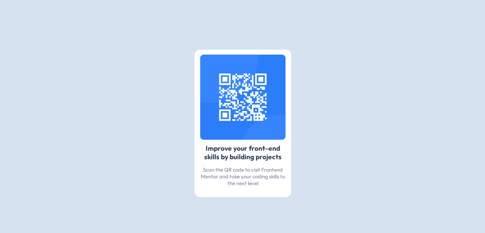
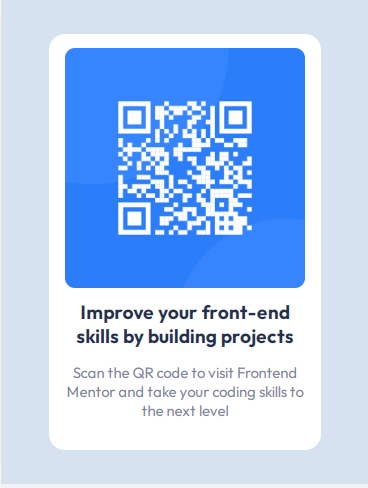

# Frontend Mentor - QR code component solution

This is a solution to the [QR code component challenge on Frontend Mentor](https://www.frontendmentor.io/challenges/qr-code-component-iux_sIO_H). Frontend Mentor challenges help you improve your coding skills by building realistic projects. 

## Table of contents

- [Overview](#overview)
  - [Screenshot](#screenshot)
  - [Links](#links)
- [My process](#my-process)
  - [Built with](#built-with)
  - [What I learned](#what-i-learned)
  - [Continued development](#continued-development)
- [Author](#author)

## Overview

### Screenshot



--> This is a screenshot of QR code component from the perspective of desktop view.



--> This is a screenshot of QR code component from the perspective of mobile view.

### Links

- Live Site URL: [Qr-code Component](https://kushagarwal11ag.github.io/QRcode-Component/)

## My process

### Built with

- Semantic HTML5 markup
- CSS custom properties
- Flexbox

### What I learned

Centering components took some time, although I was aware that using flexbox solves these issues, I was stuck because not giving height to the component.

The final thing I learned was to add Google fonts without downloading any files!
This the font I used and how I added and implemented them in my project.

```css
@import url('https://fonts.googleapis.com/css2?family=Outfit:wght@400;700&display=swap');

body {
  font-family: 'Outfit', sans-serif;
}
```

### Continued development

This project was quite simple and pretty straight forward.
I'm hoping to build more complex projects in the future.

## Author

- Frontend Mentor - [@kushagarwal11ag](https://www.frontendmentor.io/profile/kushagarwal11ag)
